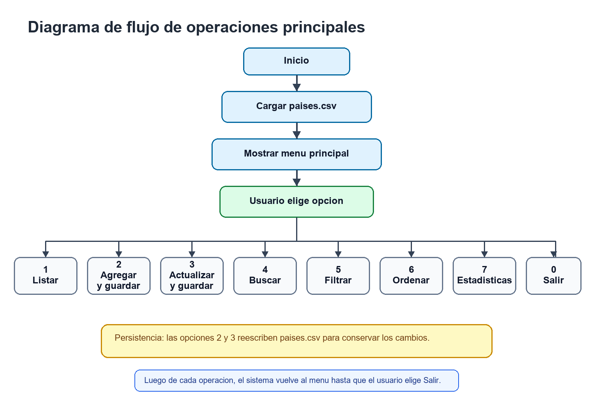
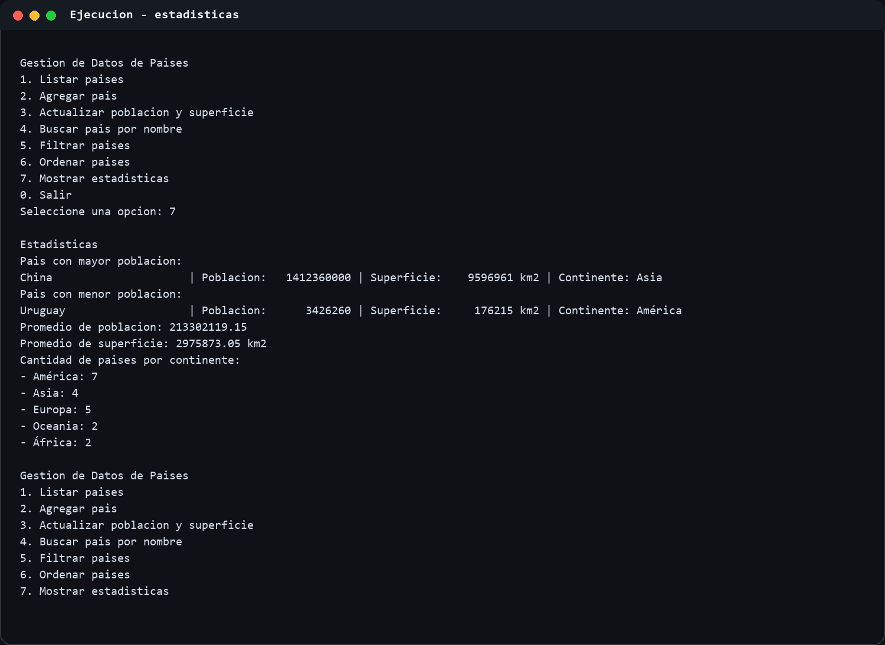
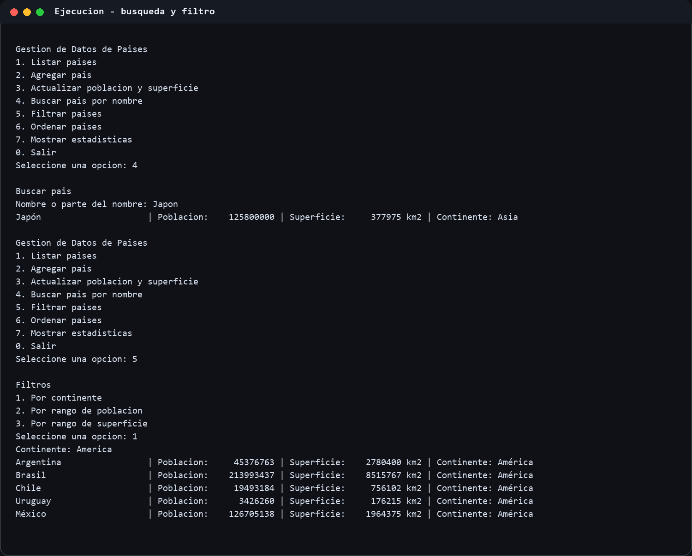

# Trabajo Practico Integrador

## Caratula

Institucion: Tecnicatura Universitaria en Programacion a Distancia  
Carrera: Tecnicatura Universitaria en Programacion  
Materia: Programacion 1  
Titulo: Gestion de Datos de Paises en Python  
Integrantes: Acuña Leandro - Alan Benitez  
Fecha de entrega: 2 de junio de 2026

## Indice

1. Caratula ........................................................................ 1  
2. Indice .......................................................................... 1  
3. Objetivo ........................................................................ 2  
4. Marco teorico ................................................................... 2  
5. Decisiones tecnicas y arquitectura ............................................... 3  
6. Diagrama de flujo ............................................................... 3  
7. Capturas de ejecucion ........................................................... 4  
8. Dificultades y conclusiones ..................................................... 5  
9. Bibliografia y enlaces .......................................................... 5

## Objetivo

Desarrollar una aplicacion de consola en Python que permita gestionar informacion de paises usando listas, diccionarios, funciones, estructuras condicionales y repetitivas, lectura y escritura de archivos CSV, filtros, ordenamientos y estadisticas basicas.

El sistema trabaja con un dataset base de 20 paises. Cada registro contiene nombre, poblacion, superficie y continente. Ademas, las operaciones de alta y actualizacion guardan los cambios en el archivo `paises.csv`, por lo que la informacion se conserva despues de finalizar la ejecucion.

## Marco teorico

### Listas

Una lista es una estructura de datos que permite almacenar varios elementos en un orden determinado. En Python, las listas son mutables y pueden recorrerse mediante ciclos, lo que permite procesar colecciones completas de datos [1]. En el proyecto se utiliza una lista para guardar todos los paises cargados desde el archivo CSV.

### Diccionarios

Un diccionario almacena informacion mediante pares clave-valor. Esta estructura permite acceder a cada dato por una clave descriptiva, como `nombre`, `poblacion`, `superficie` o `continente` [1]. En el sistema, cada pais es representado como un diccionario.

### Funciones

Las funciones permiten dividir el programa en unidades mas pequenas y reutilizables. La documentacion oficial de Python presenta las funciones como bloques con nombre que reciben datos, ejecutan instrucciones y pueden devolver resultados [1]. En el proyecto se aplico una funcion por responsabilidad: cargar datos, guardar datos, buscar, filtrar, ordenar y calcular estadisticas.

### Condicionales y ciclos

Las estructuras condicionales permiten tomar decisiones segun una opcion o una validacion. Los ciclos permiten repetir operaciones, por ejemplo recorrer todos los paises o mantener activo el menu hasta que el usuario decida salir [1].

### Ordenamientos

Python ofrece herramientas para ordenar colecciones, como `sorted`, que permite definir una clave de ordenamiento y elegir orden ascendente o descendente [1]. En el sistema se usa para ordenar paises por nombre, poblacion o superficie.

### Estadisticas basicas

Las estadisticas basicas permiten obtener informacion resumida del dataset. En este trabajo se calculan maximos, minimos, promedios y conteos por continente usando recorridos, acumuladores y funciones incorporadas de Python [1].

### Archivos CSV

CSV significa "comma-separated values" y es un formato de texto usado para representar datos tabulares. Python incluye el modulo `csv`, que facilita leer y escribir archivos con encabezados y filas [2]. En el proyecto, `paises.csv` funciona como fuente de datos inicial y como almacenamiento persistente.

## Decisiones tecnicas y arquitectura

El sistema se implementa en un unico archivo `main.py` para mantener una estructura simple, adecuada al alcance de Programacion 1. La informacion se administra en memoria como una lista de diccionarios y se sincroniza con `paises.csv` cuando el usuario agrega o actualiza un pais.

Las decisiones principales fueron:

- Usar `csv.DictReader` y `csv.DictWriter` para leer y escribir registros con encabezados.
- Validar campos vacios y numeros invalidos antes de modificar los datos.
- Separar la logica en funciones con responsabilidades especificas.
- Normalizar busquedas y filtros para aceptar texto con o sin tildes.
- Guardar automaticamente el CSV despues de cada alta o actualizacion.

## Diagrama de flujo

El siguiente diagrama resume el flujo principal del programa:

## Capturas de ejecucion

### Ejemplo 1: calculo de estadisticas

### Ejemplo 2: busqueda por nombre y filtro por continente

## Dificultades y conclusiones

Una de las principales dificultades fue controlar correctamente las entradas del usuario para evitar campos vacios, numeros invalidos o busquedas sin resultados. Para resolverlo, se crearon funciones de validacion reutilizables.

Otra dificultad fue mantener los datos actualizados en el CSV. Se resolvio guardando el archivo despues de cada operacion que modifica informacion, como agregar o actualizar un pais.

Como conclusion, el proyecto permitio practicar estructuras de datos, modularizacion, lectura y escritura de archivos, filtros, ordenamientos y calculo de estadisticas. Tambien ayudo a comprender la importancia de separar responsabilidades y validar datos antes de procesarlos.

## Bibliografia y enlaces

[1] Python Software Foundation. Documentacion oficial de Python: https://docs.python.org/3/  
[2] Python Software Foundation. Modulo csv: https://docs.python.org/3/library/csv.html  
[3] Repositorio del proyecto: https://github.com/Leanmucho/tpi-programacion-paises
